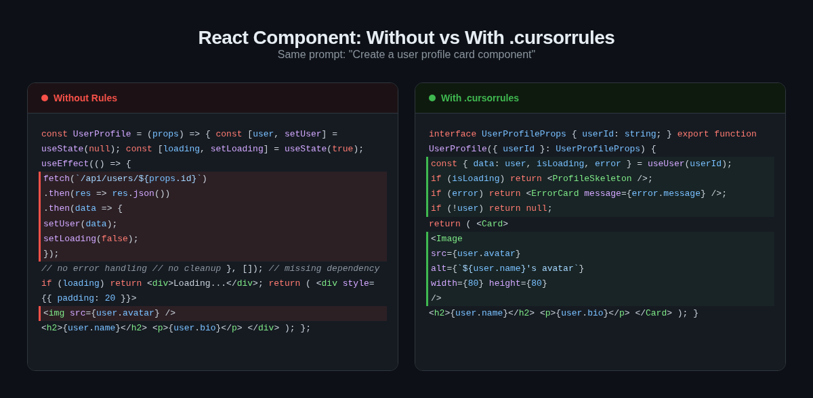
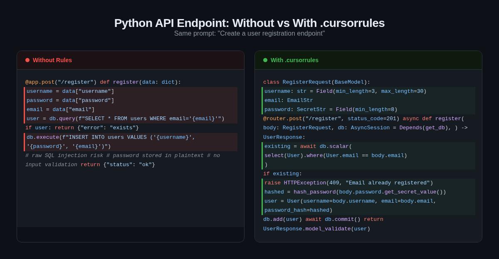
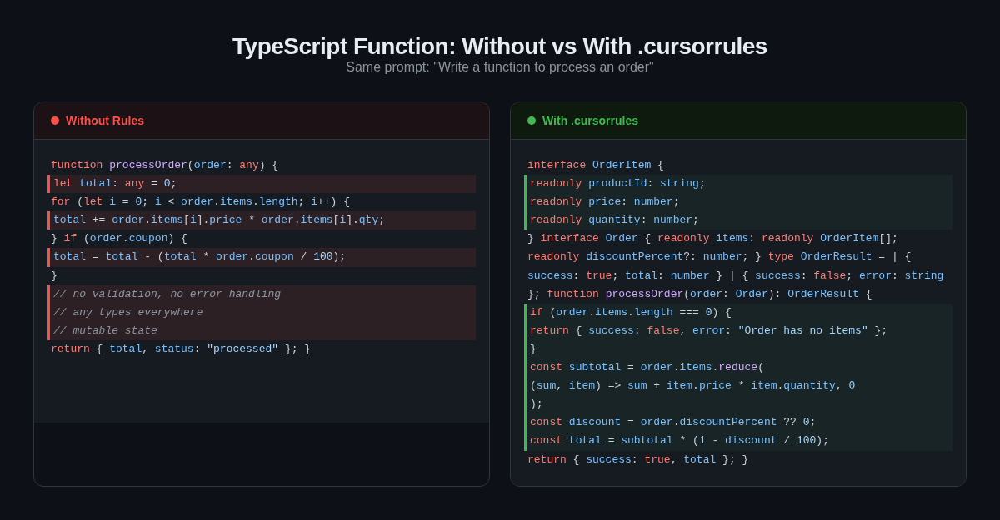

# cursorrules-collection

[](https://github.com/cursorrulespacks/cursorrules-collection)
[](LICENSE)

33 `.cursorrules` files you can drop into any project. Copy one to your project root and Cursor actually writes code the way you want it to.

If you've never used `.cursorrules` - it's a file in your project root that Cursor reads as context for every AI interaction. Think of it as a style guide the AI actually follows.

## 📝 Articles & Guides

Want to understand the thinking behind these rules? Read the deep dives on Dev.to:

- [5 .cursorrules That Actually Changed Cursor's Output](https://dev.to/nedcodes/5-cursorrules-that-actually-changed-cursors-output-and-2-that-were-useless-gel)
- [How to Write .cursorrules That Actually Work](https://dev.to/nedcodes/how-to-write-cursorrules-that-actually-work-2imd)
- [Cursor Agent Mode Ignores .cursorrules — Use .mdc Instead](https://dev.to/nedcodes/cursor-agent-mode-ignores-cursorrules-use-mdc-instead-5flb)
- [5 .cursorrules That Actually Changed What Cursor Generates (React/Next.js)](https://dev.to/nedcodes/5-cursorrules-that-actually-changed-what-cursor-generates-reactnextjs-3888)

## Before / After

Same prompts, different output. Left side is vanilla Cursor, right side is with rules applied.

**React component:**


**Python API endpoint:**


**TypeScript function:**


## Rules

### Languages

- [Python](rules/languages/python.cursorrules) - type hints, pathlib, pytest, clean error handling
- [JavaScript](rules/languages/javascript.cursorrules) - modern ES6+, async/await, pure functions
- [TypeScript](rules/languages/typescript.cursorrules) - strict mode, generics, discriminated unions
- [Go](rules/languages/go.cursorrules) - error wrapping, goroutines, interfaces
- [Rust](rules/languages/rust.cursorrules) - ownership patterns, Result types, iterators
- [Java](rules/languages/java.cursorrules) - records, sealed classes, streams
- [C#](rules/languages/csharp.cursorrules) - async/await, nullable refs, LINQ
- [Ruby](rules/languages/ruby.cursorrules) - idiomatic Ruby, blocks, RSpec
- [PHP](rules/languages/php.cursorrules) - PHP 8.x+, typed properties, PSR standards
- [Swift](rules/languages/swift.cursorrules) - SwiftUI, actors, async/await, value types

### Frameworks

- [React](rules/frameworks/react.cursorrules) - hooks, composition, performance patterns
- [Next.js](rules/frameworks/nextjs.cursorrules) - App Router, Server Components, server actions
- [Vue](rules/frameworks/vue.cursorrules) - Composition API, Pinia, script setup
- [Svelte](rules/frameworks/svelte.cursorrules) - Svelte 5 runes, reactivity, stores
- [Django](rules/frameworks/django.cursorrules) - models, views, ORM best practices
- [FastAPI](rules/frameworks/fastapi.cursorrules) - Pydantic v2, dependency injection, async
- [Express](rules/frameworks/express.cursorrules) - middleware, error handling, validation
- [Rails](rules/frameworks/rails.cursorrules) - thin controllers, service objects, Turbo
- [Laravel](rules/frameworks/laravel.cursorrules) - Eloquent, Form Requests, policies
- [Flutter](rules/frameworks/flutter.cursorrules) - Riverpod, widget extraction, Dart 3

### Practices

- [Clean Code](rules/practices/clean-code.cursorrules) - naming, functions, simplicity
- [Testing](rules/practices/testing.cursorrules) - AAA pattern, mocking, coverage strategy
- [Documentation](rules/practices/documentation.cursorrules) - code docs, READMEs, ADRs
- [Git Workflow](rules/practices/git-workflow.cursorrules) - commits, branches, PRs
- [Code Review](rules/practices/code-review.cursorrules) - reviewing, authoring, conventions
- [Security](rules/practices/security.cursorrules) - input validation, auth, data protection
- [Performance](rules/practices/performance.cursorrules) - profiling, caching, optimization
- [Accessibility](rules/practices/accessibility.cursorrules) - semantic HTML, ARIA, keyboard nav

### Tools

- [Docker](rules/tools/docker.cursorrules) - multi-stage builds, security, compose
- [Terraform](rules/tools/terraform.cursorrules) - state management, modules, safety
- [Kubernetes](rules/tools/kubernetes.cursorrules) - pods, networking, operations
- [CI/CD](rules/tools/ci-cd.cursorrules) - pipeline design, deployment, security
- [VS Code / Cursor](rules/tools/vscode.cursorrules) - workspace setup, debugging, config

## How to use

Grab a rule and drop it in your project root:

```bash
curl -o .cursorrules https://raw.githubusercontent.com/cursorrulespacks/cursorrules-collection/main/rules/languages/typescript.cursorrules
```

Need multiple? Just combine them:

```bash
cat rules/languages/typescript.cursorrules rules/frameworks/nextjs.cursorrules > .cursorrules
```

## Contributing

PRs welcome. See [CONTRIBUTING.md](CONTRIBUTING.md). The bar: rules should be specific enough to actually change Cursor's output. "Write clean code" doesn't count.

## 🛡️ Free Safety Checklist

A one-page checklist covering the most common ways Cursor agent mode can silently break your codebase, based on testing with Cursor CLI 2.4.35.

[Download the checklist (free, no email required)](https://cursorrulespacks.gumroad.com/l/cursor-safety-checklist)

## Want production-ready versions?

These community rules are a great starting point. The [production packs](https://cursorrulespacks.gumroad.com) go deeper: stricter type enforcement, error boundary patterns, auth-aware generation, and stack-specific configs tested on real codebases.

[Browse the packs](https://cursorrulespacks.gumroad.com) · [Free Starter Pack](https://cursorrulespacks.gumroad.com/l/cursor-starter)

## License

MIT
